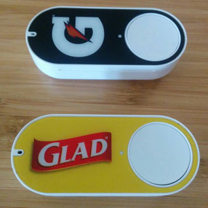

Fun with Dash buttons
===

Inspired by <a href="https://medium.com/@edwardbenson/how-i-hacked-amazon-s-5-wifi-button-to-track-baby-data-794214b0bdd8" target="_blank">this article</a>, but since I have an Intel Edison lying around, and I can compile a binary for the Edison in Go... I'm doing it in Go.

Eventually (or maybe not that long from now) this will allow me to trigger events in the real world, basically anything that I can hook up to an Edison (which means all Arduino/Seed/etc boards) using the awesome <a href="http://gobot.io/" target="_blank">gobot</a> framework.

First Time Setup
---
1. Follow the instructions that came with your Dash button, but in the final step, do NOT pick the actual product you want to replenish.  Just close the shopping app instead.

2. Run the util/identify.go script - you'll most likely (definitely?) need to run it as root: sudo GOPATH=/your/go/path go run identify.go -inf=eth0 (you can use the inf flag to specify which interface you want to listen on)

3. Press the Dash button - you should see something like:
  SourceMAC[de:ad:be:ef:01:02]

4. Save this MAC address, it's how your Dash button will be identified.

Compiling for the Edison
---
This was a bit of a pain, at least on a Mac.  See <a href="http://dequeue.blogspot.com/2015/09/compiling-go-app-that-uses-cgo-to-run.html" target="_blank">this blog post</a> for details, if you want.  Otherwise, you just need something like:

  GOARCH=386 CGO_ENABLED=1 go build --ldflags '-extldflags "-static"' listen.go

Usage
---
0. Implement whatever you want the button presses to do (there are empty functions in listen.go that handle the button presses)
1. Run listen.go (as root)
2. Press the Dash button
3. Yay!

TODO
-----
*  Allow setting up the MAC addresses dynamically?
*  <s>Hook up the gobot stuff (toggle LEDs to start)</s>
*  <s>Make sure it works on an Edison</s>
*  Try a digispark?

Example output:
<pre>
2015/08/30 12:07:31 Starting up on interface[en0]...
2015/08/30 12:07:31 Listening for Dash buttons...
2015/08/30 12:08:13 Pressed the Glad button.
2015/08/30 12:09:08 Pressed the Gatorade button.
2015/08/30 12:10:19 Pressed the Gatorade button.
2015/08/30 12:11:03 Pressed the Glad button.
2015/08/30 12:11:08 Pressed the Gatorade button.
2015/08/30 12:11:23 Pressed the Glad button.
2015/08/30 12:11:26 Pressed the Gatorade button.
</pre>

Video of the LED code in action
---
<video controls>
  <source type="video/mp4" src="led.mp4"></source>
  
Your browser does not support the video element. Download 'led.mp4' if you really want to see it in action.

</video>